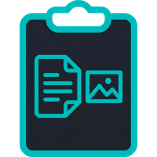

<p align="center"></p>
<h1 align="center">FastClip</h1>
<p align="center">Text and image clipboard history with quick paste on Windows.</p>
<p align="center"><a href="README.md">Русский</a> · <a href="https://github.com/Frommer-droid/FastClip/releases/latest">Latest release</a></p>

FastClip runs in the system tray and saves copied text and images. Open the popup with a global hotkey, find an item, and paste it into the active application.

## Install

Download the installer from the [latest release](https://github.com/Frommer-droid/FastClip/releases/latest) and run it on Windows. The app then appears in the system tray. Press the global `SC01D + SC010` shortcut (layout-independent scan codes) to open the history. Select an item with the mouse or press `Enter`.

To run from source, you need Windows, Python 3.12, and the packages in `requirements.txt`:

```powershell
py -3.12 -m venv .venv
.\.venv\Scripts\python.exe -m pip install -r requirements.txt
Start-Process .\.venv\Scripts\pythonw.exe -ArgumentList ".\fastclip.pyw"
```

## Features

- Text and image history, thumbnails, and content search.
- Built-in Clipboard and Photos tabs, plus custom tabs with pinned items and short notes.
- Paste images into editors or Windows folders, preserving the original filename when an image was copied as a file.
- Startup option, tray controls, and state saved across restarts.

Settings and custom tabs are stored in `settings.json`; built-in tab history is stored in `clipboard_history.txt`, and images in `clipboard_images/`. These files are created locally and are not part of the repository. Clipboard content may be sensitive, so take care when using or backing up the history.

The app uses Windows APIs and is intended for Windows. See [DEVELOPER.md](DEVELOPER.md) for checks and build instructions, and [RELEASE_NOTES.md](RELEASE_NOTES.md) for version changes.

The project's own code is licensed under [MIT](LICENSE).
